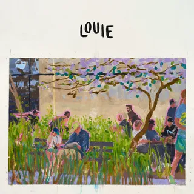

2022 was a good year for music. Here are a few of my favorite albums that I discovered and obsessed over. Arguably data driven since I used my [Last.fm](https://www.last.fm/user/mkanoria) stats

(**Disclamer**: I'm not a critic and this list is probably extremely biased. It might also contain albums that were not released in 2022, but welp)

**Is This It: The Strokes (2001)**

Julian's voice over the classic rock themes of the early 2000's was my soundtrack of the year. According to Last.fm, I listened to this album over 400 times this year, and somehow that feels like a low estimate. Previously having heard hits like Last Nite and Someday off this album, I dove into the actual album after having heard Is This It over the summer, and was immediately hooked. 

*Favorite songs*: Is This It, New York City Cops, Barely Legal, Last Nite

**Mr. Morale & the Big Steppers: Kendrick Lamar (2022)**

An album that brought about mixed emotions initially as it did not have the immediate draw of older albums like DAMN., MMTBS, definitely grew on me over subsequent listens. Kendrick's storytelling stays at the same heights as previous albums, but his sound evolves to the modern sounds of hip hop. This album definitely shows it's influence from Baby Keem, but still stays grounded with Kendrick's signature touch. 

*Favorite songs*: Silent Hill, Father Time, We Cry Together, Rich Spirit

**CALL ME IF YOU GET LOST: Tyler, the Creator (2021)**

What can this man not do. After the critically aclaimed IGOR, Tyler brings back the smooth sounds that we loved on songs like Boredom and See you again off of Flower Boy, clearly showing the improvement in his craft. The perfect album when *the sun beamin'* or when you want to mentally transport to those times, CMIYGL is always the mood boost you need. The carefully curated features go to show Tyler's producing chops (I mean who was expecting THAT youngboy verse), while the songs like SWEET / I THOUGHT YOU WANTED TO DANCE and WILSHIRE help flex his pen.

*Favorite songs:* WUSYANAME, JUGGERNAUT, LEMONHEAD, SWEET / I THOUGHT YOU WANTED TO DANCE

**LOUIE: Kenny Beats (2022)**

Having been a Kenny fan from his Twitch days to the legendary Cave series ([Jesus Is the One](https://www.youtube.com/watch?v=vSSLqHJzy6Y) is still his best song, fight me) I was excited to see what he was going to show us on LOUIE. With Kenny's genre bending production skills from bangers like Foot Fungus and Baguetti, to more mellow beats like ARE YOU WITH THAT, I was not sure what to expect. What we got did not disappoint at all - the album still has features from trusted collaborators like Vince Staples, Slowthai and Remi Wolf but goes to display more off his production chops. Kenny creates a unique vibe, and the (limited) features perfectly add to it without taking too much of the spotlight.

*Favorite songs:* Family Tree, Still, Eternal, Rotten

**Melt My Eyes See Your Future: Denzel Curry (2022)**

*Favorite Songs:* Walkin, Ain't No Way, Troubles, X-Wing

**The Melodic Blue: Baby Keem (2021)**

As Kendrick puts it, *He's Baby Keem*
This album is marks Baby Keem's arrival - full with bangers like Family Ties and range brothers, and smooth r&b with lost souls (Brent Faiyaz 🤌) and 16. You cannot stay seated when you Kendrick and Keem  are [performing Family Ties](https://www.youtube.com/watch?v=NeKrFYrAZwQ).

*Favorite Songs:* lost souls, 16, Family Ties, issues

**Honorable Mentions**: When We Were Friends (The Backseat Lovers), Dawn FM (The Weeknd), The New Abnormal (The Strokes), Un Verano Sin Ti (Bad Bunny), Heroes & Villains (Metro Boomin), I Know NIGO! (Nigo)
